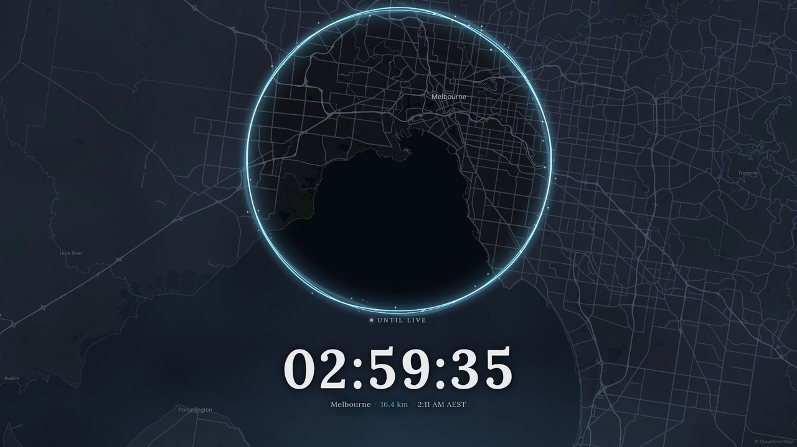

# The Circle

A battle-royale circle closing in on tonight's location, as an OBS overlay. Dark map,
drifting fog, countdown to go live — a "find the streamer" treasure hunt for your chat.


It opens country-wide and narrows over the hours before you go live, naming one rung at a
time — **country → state → city → suburb**, and never anything more specific. Street names
are stripped from the map and the venue's own name is never shown.



The camera stops at roughly a city block, so viewers get the neighbourhood and have to work
out the rest.


## Install

**[⬇ Download the latest release](https://github.com/Obsidiate/obs-the-circle/releases/latest)**,
unzip it anywhere, and:

| | |
|---|---|
| **Windows** | double-click `start.cmd` |
| **macOS** | double-click `start.command` |
| **Linux** | run `./start.sh` |

A window opens and the control panel appears in your browser. Leave that window running
while you stream.

Then in OBS — no plugin, nothing to compile:

1. **Sources → + → Browser** → `http://localhost:7333/overlay?layout=full`, 1920×1080.
   Untick *Shutdown source when not visible*.
2. **Docks → Custom Browser Docks…** → name it `Circle`, URL `http://localhost:7333/control`.

Both URLs sit in the control panel with copy buttons, so you never have to type them.

### Or let OBS start it for you

If you'd rather not start anything by hand, add the bundled script once:

**Tools → Scripts → +** → pick `obs/the-circle.lua`, then set **App folder** to where you
unzipped it.

From then on The Circle starts when OBS starts and stops when OBS stops — nothing runs
while OBS is closed. OBS has Lua built in, so there's still no plugin to install and
nothing to compile. If OBS is force-quit, a heartbeat makes the server shut itself down
within about 90 seconds rather than lingering.

You still add the browser source and dock as above; the script's description panel in OBS
shows both URLs.

The only requirement is [Node.js](https://nodejs.org) (take the LTS installer). The
release bundles everything else — there's no `npm install`.

<details>
<summary>Running from a clone instead</summary>

```bash
npm install
npm start
```
</details>

## Control panel


**Running late?** Hit +5 through +60. The circle **holds** where it is instead of jumping
backwards, then resumes closing once the new schedule catches up. Past go-live the clock
keeps counting *negative*, so it's obvious you're behind rather than frozen.

Move the location and it eases back out to country scale and starts again.

## Handy

- The server prints a **LAN URL** on start — open the panel on your phone and push a delay
  from the location itself.
- `?layout=panel` gives a compact corner widget instead of a full screen.
- `?at=<iso>&speed=600` fast-runs the whole sequence in seconds, for testing.
- `npm test` checks the schedule maths — monotonic closure, the delay hold, the zoom floor,
  and that the venue name never leaks at any radius.

Everything renders from `(config, wall clock)` with no stored animation state, so
refreshing the source or restarting OBS mid-stream picks up exactly where it left off.

---

Maps © OpenStreetMap contributors, tiles by [OpenFreeMap](https://openfreemap.org).
