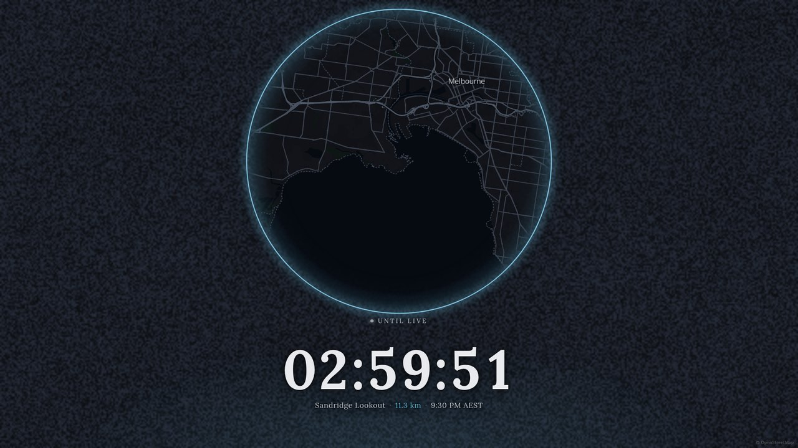
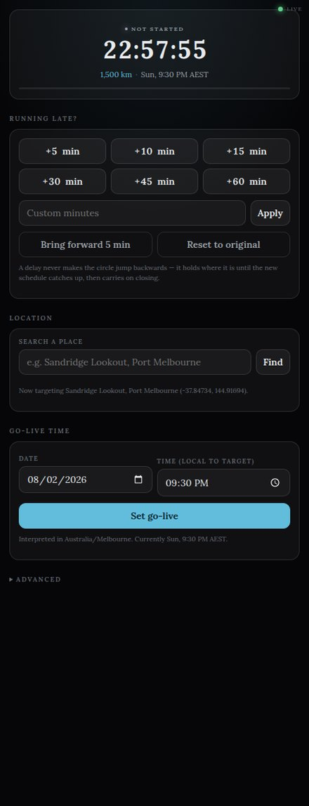
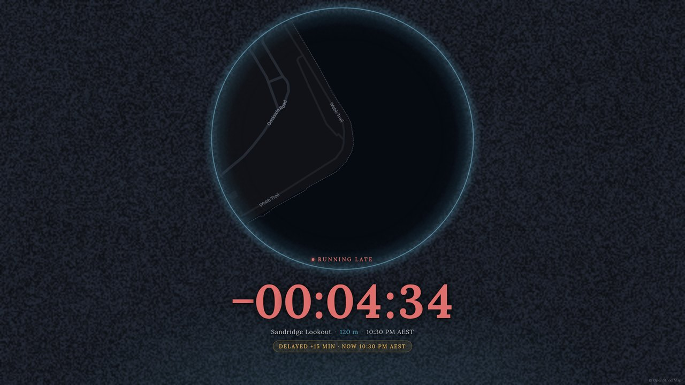

# The Circle

A battle-royale ring closing in on tonight's location, as an OBS overlay. Dark map,
shrinking wall of static, countdown to go live.



## Setup

```bash
npm install
npm start
```

Then, in OBS:

1. **Sources → + → Browser** → `http://localhost:7333/overlay?layout=full`, 1920×1080.
   Untick *Shutdown source when not visible*.
2. **Docks → Custom Browser Docks…** → name it `Circle`, URL `http://localhost:7333/control`.

No plugin to install. The overlay is an ordinary browser source; the control panel is a
dock that lives inside the OBS window.

## Control panel



Search a place, set a go-live time in *that place's* timezone, and the circle closes in
over the hours before — starting country-wide, drifting off-centre so nobody can read your
location off the map early, and homing in over the last stretch.

**Running late?** Hit +5 through +60. The circle **holds** where it is instead of jumping
backwards, then resumes closing once the new schedule catches up. Past go-live the clock
keeps counting *negative*, so it's obvious you're behind rather than frozen.



## Handy

- The server prints a **LAN URL** on start — open the panel on your phone and push a delay
  from the location itself.
- `?layout=panel` gives a compact corner widget instead of a full screen.
- `?at=<iso>&speed=600` fast-runs the whole sequence in seconds, for testing.
- `npm test` checks the schedule maths (monotonic closure, the delay hold, determinism).

Everything renders from `(config, wall clock)` with no stored animation state, so
refreshing the source or restarting OBS mid-stream picks up exactly where it left off.

---

Maps © OpenStreetMap contributors, tiles by [OpenFreeMap](https://openfreemap.org).
